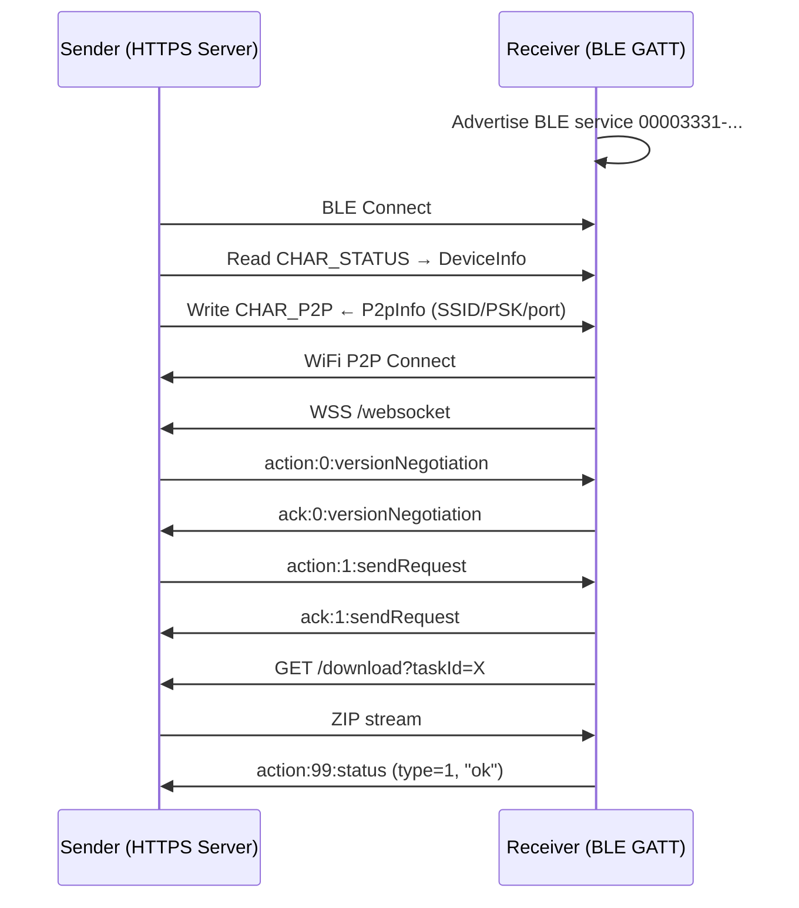

# mtapy

Python3 implementation of the MTA (Mutual Transmission Alliance) file transfer protocol based on [CatShare](https://github.com/kmod-midori/CatShare/)

MTA is used by Xiaomi, OPPO, vivo, OnePlus, Realme, and other Android manufacturers for cross-brand file sharing.

互传联盟（Mutual Transmission Alliance）是由小米、OPPO和vivo于2019年成立的，旨在实现跨品牌(安卓)设备之间的快速文件传输。Android阵营已加入的有：小米、OPPO、vivo、联想、realme、努比亚、海信、魅族、一加、坚果、黑鲨、中兴、ROG、华硕、三星、荣耀

Now your favorite desktop OS joins the alliance! 现在你钟爱的桌面系统也加入联盟！

## Protocol Overview



## Architecture

The library is structured in **sans-io** style:

- `protocol.py`, `receiver.py`, `sender.py` - Pure protocol logic, no I/O
- `transport.py` - Asyncio-based transport implementation
- `interfaces.py` - Abstract interfaces for crypto, BLE, WiFi P2P

## Protocol Overview

1. **BLE Discovery** - Devices advertise via BLE GATT service
2. **Credential Exchange** - Sender writes WiFi P2P credentials to receiver via BLE
3. **P2P Connection** - Receiver joins sender's WiFi P2P group
4. **WebSocket Handshake** - Version negotiation and transfer request
5. **File Transfer** - Receiver downloads ZIP archive over HTTPS


## Installation

```bash
pip install mtapy

# With crypto support (ECDH/AES for encrypted transfers)
pip install mtapy[crypto]

# With BLE support (device discovery using bleak)
pip install mtapy[ble]

# All optional dependencies
pip install mtapy[all]
```

## Running on macOS

1. **Install Dependencies**:
   ```bash
   pip install cryptography bleak websockets
   ```

2. **Run BLE Discovery Demo**:
   To scan for nearby MTA-compatible devices (Xiaomi, OPPO, vivo, etc.):
   ```bash
   python3 macos_demo.py
   ```

3. **Development/Test**:
   You can run the included unit tests using `pytest`:
   ```bash
   pytest mtapy/tests/ -v
   ```


## License

GPL-3.0
